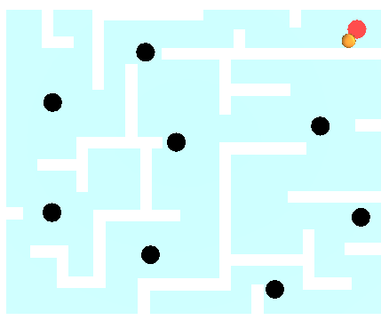
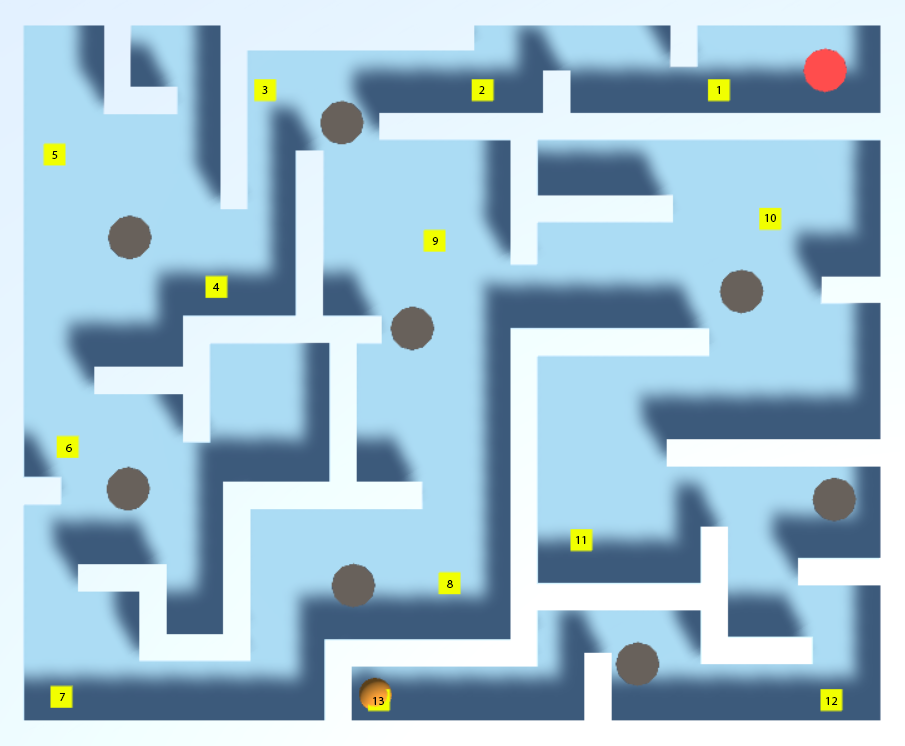

# Ball Labyrinth

## Model Details

### Environment

The Ball Labyrinth environment is inspired by the Brio Labyrinth. A labyrinth made of walls and holes make up the game board. The goal of the game is to rotate the board in two dimensions to make the ball roll into the final hole, while avoiding the other ones.

### Output Actions

The agent is capable of rotating along the x and z axis continuously(negative and positive directions, -2 to +2).

### State Input

The agent receives input from an orthogonal camera which captures a top-down view. The observation is turned into a 64x64 grayscale. Additionally, the state space comprises the rotation of the board and the ball's velocity. Additionally, the agent knows if the ball is inside a corner or not.

### Reward Signals

Rewards are signaled for reaching the final (red) goal (+1), moving out of bounds(-1) and falling through the wrong hole (-1). A small punishment is handed out if the ball is located inside a corner (-0.075).

### Curriculum Learning

The difficulty is gradually increased by spawning the ball farther away from the final hole each time.

## Results
So far the agent reaches lesson 3, but cannot get passed that. Sometimes, the agent does not pass lesson 0. So the training is pretty unstable.
