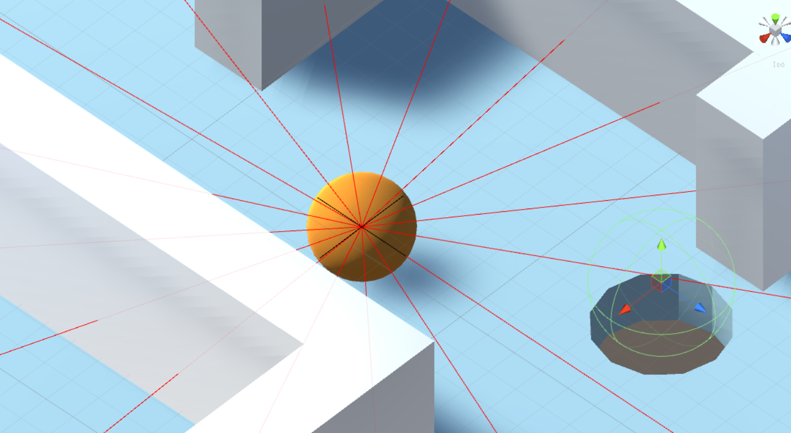
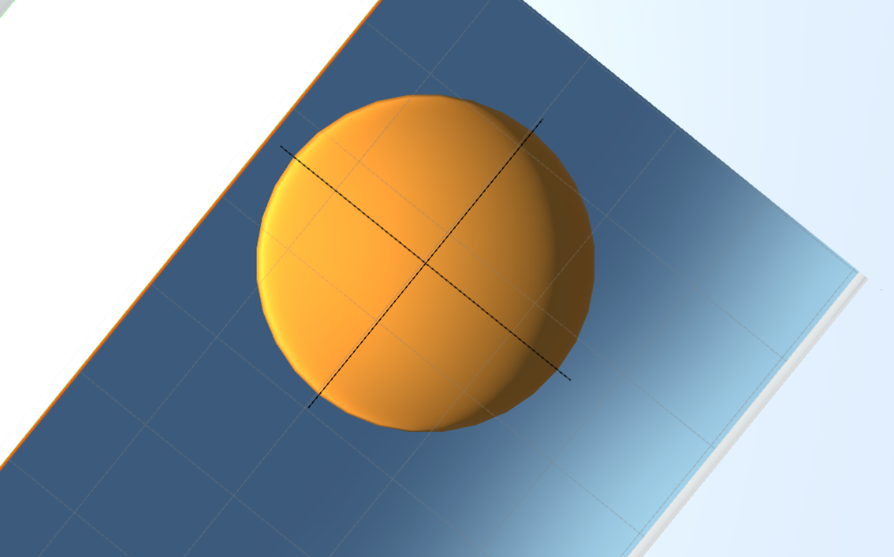

# Ball Labyrinth

## Model Details

### Environment

The Ball Labyrinth environment is inspired by the Brio Labyrinth. A maze made of walls and holes make up the game board. The goal of the game is to rotate the board in two dimensions to make the ball roll into the final hole, while avoiding the other ones.

### Output Actions

The agent is capable of rotating along the x and z axis continuously (negative and positive directions, -2 to +2).

### State Input

Right now, the agent's state is described by the following inputs:

- x and z rotation of the board
- ball velocity
- relative position of the ball towards the target
- distance between the ball and the target
- ball height relative to the board
- raycasting surrounding walls (distances)
- raycasting surrounding holes (distances)
- ball is cornored

A desired future input is an orthogonal camera observation from the board like seen below.

### Reward Signals

Rewards are signaled for reaching the final (red) goal (+1.25), moving out of bounds(-1) and falling through the wrong hole (-1). A small punishment is handed out if the ball is located inside a corner (-0.05).

### Curriculum Learning

The difficulty is gradually increased by spawning the ball farther away from the final hole each time.

## Results
So far the agent reaches lesson 5, but cannot get passed that.
