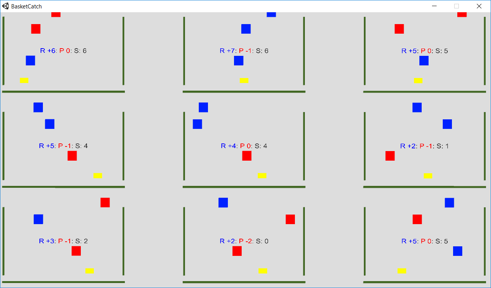
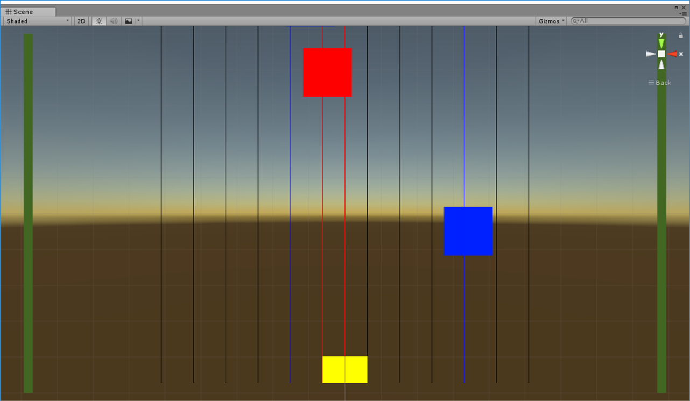

# Basket Catch

## Model Details

### Environment

In Basket Catch, the agent (yellow box), is supposed to catch blue boxes and to avoid red ones. The moving space is constrained by two walls. The collectable items spawn on top of the environment at random positions. 35% of the spawned boxes are blue.

### Output Actions

The agent is capable of moving left, moving right and not moving at all. These actions are discrete.

### State Input

The agent has a total number of 28 inputs. 2 inputs sense the distance to the walls and the other inputs are based on 13 "eyes". Each eye is capable of observing two values. It can determine if it sees a reward or punishment and the distance to it. Thus the input space is continuous. One limitation is that it cannot see rewards which are behind a reward. The same applies to punishing boxes, but red boxes will not obscure blue ones.

### Reward Signals

Rewards are signaled for catching a blue box (+1) or catching a red box (-1).

## Results

This is so far the best [result](https://youtu.be/kbIe_UtuNCk) using [Unity's implementation](https://github.com/Unity-Technologies/ml-agents/blob/master/python/PPO.ipynb) of [PPO](https://arxiv.org/abs/1707.06347).