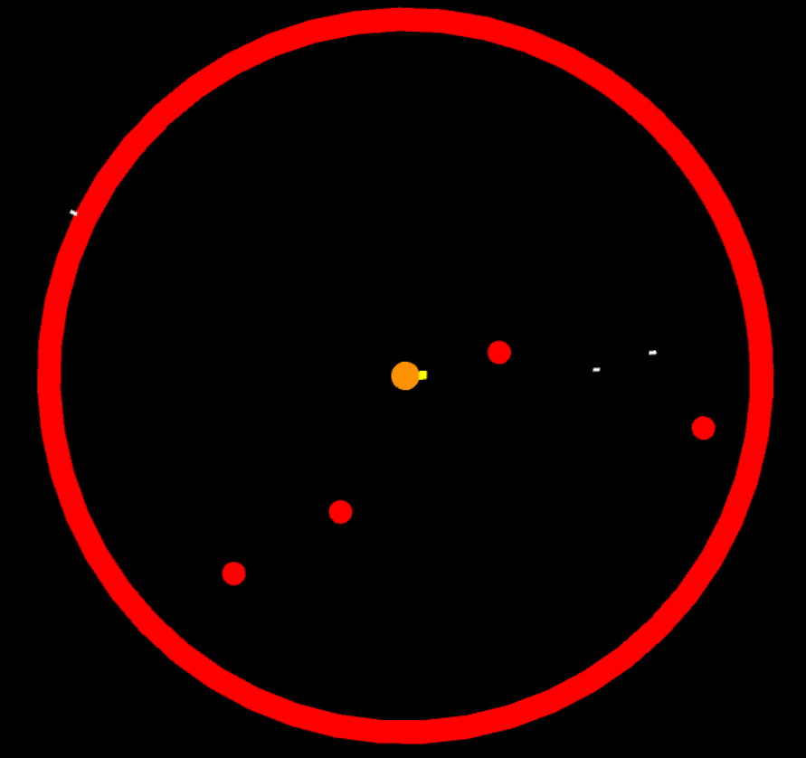
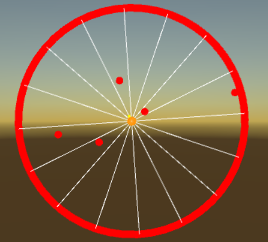

# Destroy Comets

## Model Details

### Environment

Destroy Comets features a 2D environment where a cannon has to shoot comets while not getting hit. Comets spawn on a certain radius and fly towards the comet with altering displacements on their velocity.

### Output Actions

The action space is discrete. The agent is able to rotate left and right and shoot. Two more actions combine shooting and rotating.

### State Input

The agent has a total number of 18 inputs. It has 16 "eyes" (like seen below) to measure the distance to comets. The vision rotates along with the cannon. The remaining information of the state space is the current rotation of the agent.

### Reward Signals

The agent is rewarded for shooting a comet (+1) and punished for getting hit by one (-1). Shooting is penalized by -0.05.

## Results

One old result can be watched [here](https://www.youtube.com/watch?v=d1HEhY7TwSE). If shooting is not constrained, the agent learns to keep rotating and shooting. The current results are not sufficient. Work on the agent's observation has to be done.
