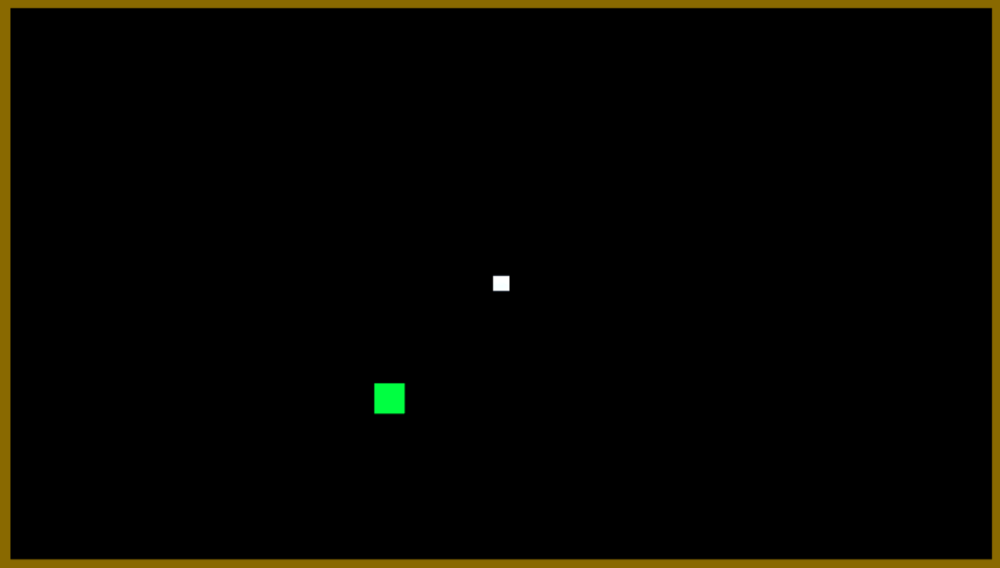

# Simple Continuous Control

## Model Details

### Environment

This environment just serves the purpose of being a low scale example for making the first experiences of working with image input. The agent (white box) is supposed to move to the target (green box). The environment is constrained by walls. 

### Output Actions

The agent moves continuously in two dimensions.

### State Input

The agent receives 4 continuos inputs: direction vector to the target (x & y) and the agent's velocity (x & y). The other input is a 64x36 grayscale.

### Reward Signals

A reward of +1 is signaled to the agent for reaching its target.

## Results

The defined problem is easy to solve for the agent if it only makes use of the continuous inputs. If the image is added to the input space, the agent gets stuck in corners. I still have to investigate if this is a problem of the input image or the hyperparameters.